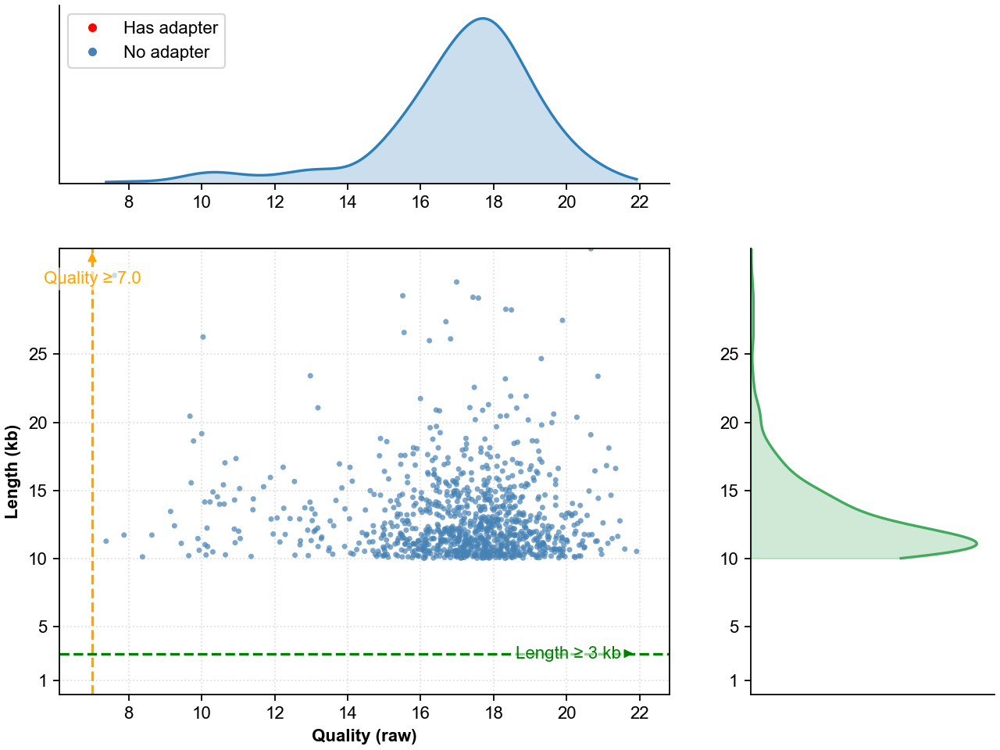

# CycFilt

## 可视化统计与报告

本项目提供了一个可视化脚本用于对过滤统计结果进行图形化展示并生成报告：`scripts/CycFqStatPlot.py`。它会根据过滤时的质量阈值与长度阈值绘制散点分布图，并生成过滤流程的 Sankey 流图，最后合并为一个 PDF 报告。

### 依赖

- Python 3.8+
- 必需：`pandas`、`numpy`、`matplotlib`、`pypdf`
- 可选（用于 Sankey 图和其 PDF 导出）：`plotly`、`kaleido`

安装示例：

```
pip install pandas numpy matplotlib pypdf plotly kaleido
```

### 输入数据

- 可视化脚本读取过滤统计文件：`xxx.stat.csv` 或 `xxx.stat.csv.gz`。
- 统计文件需包含以下列：`read_id`, `quality`, `length`, `has_adapter`, `quality_pass`, `length_pass`, `final_output_count`。

通常在运行主程序完成过滤后会生成上述统计文件（示例见 `example/sample.clean.fastq.stat.csv.gz`；仓库也提供了解压后的 `.csv`）。

### 用法

```
python scripts/CycFqStatPlot.py \
  --csv example/sample.clean.fastq.stat.csv \
  --min-quality 10 \
  --min-length 1000 \
  --out-dir example
```

- `--csv`：统计文件路径（支持 `.csv` 与 `.csv.gz`）。
- `--min-quality`：过滤时使用的质量阈值（与主程序保持一致）。
- `--min-length`：过滤时使用的长度阈值（单位 bp，与主程序保持一致）。
- `--out-dir`：输出目录（默认与统计文件同目录）。

脚本会生成如下文件：

- 散点图（PNG）：`xxx.stat.scatter.png`
- 散点图页面（PDF）：`xxx.stat.scatter.page.pdf`
- Sankey 流图（HTML）：`xxx.stat.sankey.html`
- Sankey 流图页面（PDF，需 `kaleido`）：`xxx.stat.sankey.page.pdf`
- 合并报告（PDF）：`xxx.stat.report.pdf`

### 示例输出

仓库中已提供示例输出：

- `example/sample.clean.fastq.stat.report.pdf`
- `example/sample.clean.fastq.stat.scatter.page.pdf`
- `example/sample.clean.fastq.stat.sankey.html`
- `example/sample.clean.fastq.stat.sankey.page.pdf`

### 示例图片

散点分布图（质量-长度分布）：



更多示例与交互查看：

- 合并报告（PDF）：[example/sample.clean.fastq.stat.report.pdf](example/sample.clean.fastq.stat.csv.report.pdf)
- Sankey 流图（交互版 HTML）：[example/sample.clean.fastq.stat.sankey.html](example/sample.clean.fastq.stat.csv.sankey.html)
- Sankey 流图页面（PDF）：[example/sample.clean.fastq.stat.sankey.page.pdf](example/sample.clean.fastq.stat.csv.sankey.page.pdf)

### 生成统计文件示例（参考）

以下为示例运行命令以生成清洗后的 fastq 及统计文件（路径与参数可按需调整）：

```
../target/debug/cyc_filt \
  -i example/sample.fastq \
  -o example/sample.clean.fastq.gz \
  -a AATTTAAGTGAAATGCTAAAATCAAAGGTTATGAA \
  -x 3 -d 1 -s
```

其中 `-s` 用于开启每条读的统计，并将统计保存为 `<输出文件名>.stat.csv.gz`；其他参数含义以主程序帮助为准。完成后在 `example/` 目录可看到 `sample.clean.fastq.stat.csv.gz`（仓库同时提供了解压版 `.csv`），再使用上文的可视化脚本生成图与报告。

### 备注

- 若未安装 `plotly` 或其静态导出依赖（如 `kaleido`），将仅生成 Sankey 的 HTML 文件，Sankey 的 PDF 页面可能无法导出。
- 请确保在可视化时设置的 `--min-quality`、`--min-length` 与实际过滤过程保持一致，以便图中阈值线与结果一致。
tiny tool for CycloneSEQ reads filtering


## INSTALL

```shell
git clone https://github.com/comery/CycFilt.git
cd CycFilt
cargo build
# target is : target/debug/cyc_filt
or cargo build --release
# target is : target/release/cyc_filt
```


## Usage

```shell
Usage: cyc_filt [OPTIONS] --input <input_file> --output <output_file>

Options:
  -i, --input <input_file>
          Input FASTQ file
  -o, --output <output_file>
          Output FASTQ file
  -q, --min-quality <min_quality>
          Minimum quality score [default: 7.0]
  -l, --min-length <min_length>
          Minimum sequence length [default: 1000]
  -c, --cpus <num_cpus>
          Number of cpus to use [default: 2]
  -b, --batch-size <batch_size>
          Batch size for processing [default: 10000]
  -a, --adapter <adapter>
          Adapter sequence to detect and remove
  -m, --min-adapter-match <min_adapter_match>
          Minimum adapter match length [default: 10]
  -x, --max-mismatches <max_mismatches>
          Maximum allowed mismatches in adapter alignment [default: 2]
  -d, --max-indels <max_indels>
          Maximum allowed indels in adapter alignment [default: 1]
  -s, --stat
          Enable per-read statistics and save to <output>.stat.csv.gz
  -h, --help
          Print help


e.g.
cyc_filt -i test.fastq.gz -o test.hq.fq.gz -q 7 -l 1000 -t 4
cyc_filt -i test.fastq.gz -o test.hq.fq.gz -a GGGTGACAGAGCAAGACCCTGTCTCAGAA  -x 3 -d 1  -s

```


## Change logs

- V2.1.0 # 20251106
   
   - add visualization script, plot_sankey and plot_scatter using CycFqStatPlot.py from stat.csv.gz file
   
- V2.0.1 # 20250829

   - improve the adapter sequence identification to handle reverse complement cases

- V2.0.0 # 20250826
   - Improve performance
   - Add the function of adapter detecting and trimming

- V1.2.0, # 20240708

  - Multi CPUs instead of threads

- V1.1.1

  - add chunk size for batch reading and processing

- v1.1.0

  - Multi-threads with syn read and write

- V1.0.0

  - multi-threads with async read and write

- v0.1.0

  - single thread for running

  
